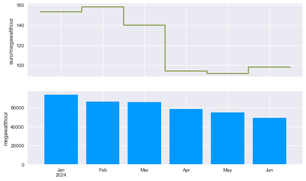

Getting started
###############

This library is used for monitoring portfolios (getting the current best-picture) and doing risk analyses (possible future developments).

As a data source, Belvis is commonly used. We first need to authorize with its REST-API:
   
   >>> import lichtblyck as lb
   >>> lb.belvis.auth_with_password('MyFirst.LastName', 'my_long_and_5tr0ng_password')

Then, we can get portfolio state of several pre-defined portfolios. The available ones are found here:

.. code-block::

   >>> lb.portfolios.PFNAMES
   {'power': ['PKG', 'NSP', 'WP', 'LUD_STG', 'LUD_NSP', 'LUD_WP', 'B2C_P2H', 'B2C_HH'], 'gas': []}

And read the current portfolio state from Belvis using

.. code-block::

   >>> pfs = lb.portfolios.pfstate('power', 'PKG', '2024', '2024-07')
   (...)
   
   >>> pfs
   PfState object.
   . Timestamps: first: 2024-01-01 00:00:00+01:00     timezone: Europe/Berlin
                  last: 2024-06-30 23:45:00+02:00         freq: <15 * Minutes> (17468 datapoints)
                                                   w           q           p             r
                                                  MW         MWh     Eur/MWh           Eur
   ──────── offtake
              2024-01-01 00:00:00 +0100        -79.9         -20                          
              2024-01-01 00:15:00 +0100        -74.6         -19                          
              ..                                  ..          ..          ..            ..
              2024-06-30 23:30:00 +0200        -56.8         -14                          
              2024-06-30 23:45:00 +0200        -51.3         -13                          
   ─●────── pnl_cost
    │         2024-01-01 00:00:00 +0100         79.9          20      144.63         2 887
    │         2024-01-01 00:15:00 +0100         74.6          19      107.89         2 012
    │         ..                                  ..          ..          ..            ..
    │         2024-06-30 23:30:00 +0200         56.8          14       72.84         1 035
    │         2024-06-30 23:45:00 +0200         51.3          13       55.77           715
    ├────── sourced
    │         2024-01-01 00:00:00 +0100          1.0           0      104.80            26
    │         2024-01-01 00:15:00 +0100          1.0           0      104.80            26
    │         ..                                  ..          ..          ..            ..
    │         2024-06-30 23:30:00 +0200          1.0           0      104.80            26
    │         2024-06-30 23:45:00 +0200          1.0           0      104.80            26
    └────── unsourced
              2024-01-01 00:00:00 +0100         78.9          20      145.13         2 861
              2024-01-01 00:15:00 +0100         73.6          18      107.94         1 986
              ..                                  ..          ..          ..            ..
              2024-06-30 23:30:00 +0200         55.8          14       72.27         1 009
              2024-06-30 23:45:00 +0200         50.3          13       54.79           689

From here, we can do various common operations. For example, we can aggregate the data (which is currently in 15-min frequency) to monthly values, and see what the current procurement cost is for the portfolio:

.. code-block::

   >>> monthly = pfs.changefreq('MS')
   >>> monthly.pnl_cost

   PfLine object with price and volume information.
   . Timestamps: first: 2024-01-01 00:00:00+01:00     timezone: Europe/Berlin
                  last: 2024-06-01 00:00:00+02:00         freq: <MonthBegin> (6 datapoints)
   . Children: 'sourced' (price and volume), 'unsourced' (price and volume)

                                        w           q           p             r
                                       MW         MWh     Eur/MWh           Eur

   2024-01-01 00:00:00 +0100         98.8      73 543      153.41    11 282 388
   2024-02-01 00:00:00 +0100         95.4      66 431      158.09    10 502 109
   2024-03-01 00:00:00 +0100         88.9      66 050      139.85     9 237 082
   2024-04-01 00:00:00 +0200         81.3      58 572       94.36     5 526 987
   2024-05-01 00:00:00 +0200         73.7      54 859       91.95     5 044 570
   2024-06-01 00:00:00 +0200         68.6      49 423       98.12     4 849 273

The `.plot()` method allows us to see the same data visually:

.. code-block::

   >>> monthly.pnl_cost.plot()

We can analyse what happens, if market prices rise by 50%:

.. code-block::

   >>> expensive = pfs.set_unsourcedprice(pfs.unsourcedprice * 1.5)
   >>> expensive.changefreq('MS').pnl_cost
   
   PfLine object with price and volume information.
   . Timestamps: first: 2024-01-01 00:00:00+01:00     timezone: Europe/Berlin
                  last: 2024-06-01 00:00:00+02:00         freq: <MonthBegin> (6 datapoints)
   . Children: 'sourced' (price and volume), 'unsourced' (price and volume)
   
                                        w           q           p             r
                                       MW         MWh     Eur/MWh           Eur
   
   2024-01-01 00:00:00 +0100         98.8      73 543      229.35    16 866 649
   2024-02-01 00:00:00 +0100         95.4      66 431      236.34    15 700 307
   2024-03-01 00:00:00 +0100         88.9      66 050      208.94    13 800 303
   2024-04-01 00:00:00 +0200         81.3      58 572      140.61     8 235 586
   2024-05-01 00:00:00 +0200         73.7      54 859      136.89     7 509 922
   2024-06-01 00:00:00 +0200         68.6      49 423      146.10     7 220 576

If we want, we can export the data to Excel, in order to continue our analyses there:

.. code-block::

   >>> pfs.to_excel('pkg_2024H1.xlsx')

Or, if we have an excel workbook already open, we can copy-paste the data to-from the clipboard:

.. code-block::

   >>> pfs.to_clipboard()

